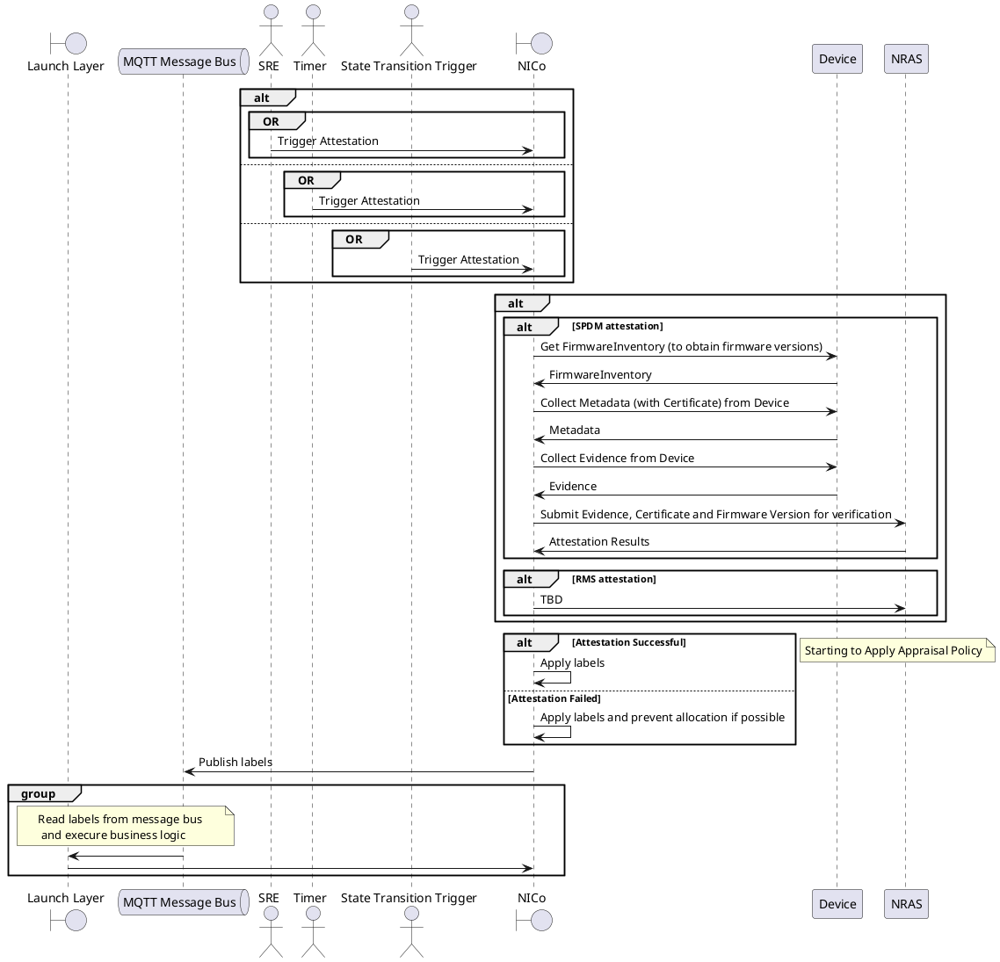

# Introduction

SPDM attestation has been created to enable attestation of various components within managed hosts, for example GPUs, CPUs, DPUs. The design for that change can be found here - TBC.

Due to various roadmap changes, a new attestation approach has been given priority, where a number of services work together to enable attestation of a much wider range of components, such as managed host devices (CPUs, GPUs etc), but also external devices, such as NV switches and other external components. Additionally, the attestation logic has been moved from NICo to other services. To this end, the existing SPDM attestation needs to be reworked to conform to the new attestation model. This document builds on top of the existing SPDM approach and outlines the changes needed to achieve the new goal.

The proposed new name instead of SPDM Attestation is NICo Attestation.

# Actors
```plantuml
actor "NICo State Controller" as NICoST
actor SRE

rectangle NICo {
  usecase "Trigger Attestation" as UC1
  usecase "Monitor Attestation" as UC2
  usecase "Quarantine failed NV switch and its dependants" as UC3
  usecase "TBD" as UC4
  usecase "Apply labels" as UC5
}

rectangle RMS {
  usecase "Get Attestation Data" as RUC1
}

rectangle SPDM {
  usecase "Get Attestation Data" as SUC1
}

rectangle NRAS {
  usecase "Attest" as NUC1
}

NICoST --> UC1
NICoST --> UC2
NICoST --> UC3
NICoST --> UC4
NICoST --> UC5

NICoST --> RUC1
NICoST --> NUC1

NICoST --> SUC1

SRE --> UC1
SRE --> UC2
```

# Workflows
## Attestation of SPDM Devices


## Attestation of RMS Devices

# Interfaces

# Objects, Entities, Processes and DB Tables

# Tickets and Verification
## Changes to the Existing SPDM Workflow
1. ObjectId needs to be flexible to encompass not only machine id + device id, but also various unique ids that can help identify other devices.
Expected outcome: SPDM attestation still works, but attestation ids now look different.
2. Instead of putting a machine into a failed state and back, NICo now needs to apply labels. Also the labels information needs to be streamed on a message bus. Labels must be uniquely connected to an attestation result.
Expected outcome: MH does not go into a Failed state if attestation fails. Instead, labels are applied to it and streamed via a message bus. When NICo is hosted without a LaunchLayer, an alternative solution needs to be able to apply policy. This can also be used for interim testing.
3. Separate workflows inside SPDM state handler to cater for various types of attestation.
Expected outcome: the existing attestation still works, but now handled in a separate branch. The branch will be specific for each attestation type as defined in ObjectId's encoded type.
4. Rename SPDM attestation to NICo attestation. SPDM will now be just a transport to get attestation data.
Expected outcome: there are some generic parts, as well as SPDM and RMS specific parts.
5. When attestation is triggered, a job id needs to be provided. That job id can then be used to poll the status of attestation.
Expected outcome: currently, we simply poll by machine id to learn the latest attestation status. Now, the trigger gRPC call will return a job id, the polling will happen using that job id. Will also need to rework admin-cli methods to use the job id and to fetch the status of attestation. Change the hierarchy/topology of attestation commands on admin-cli side.
7. For every attestation stage/state, provide an explicit mechanism to cope with retries, failures etc. It all must be reflected in the polling status.
Expected outcome: when polling with a job id, the status will have clear indication what stage the attestation is at. Also, there is a limit on a number of retries and clear rules on what happens, when that limit is exceeded, such as label being applied etc etc.
8. There needs to be a contract between the Launch Layer and NICo to perform necessary manipulations. As a result, there will be a gRPC interface in NICo that Launch Layer will be using.

<!--The above is all about changes to existing attestation. The below is new work.-->
## NV Switch Attestation

# Milestones and Timelines